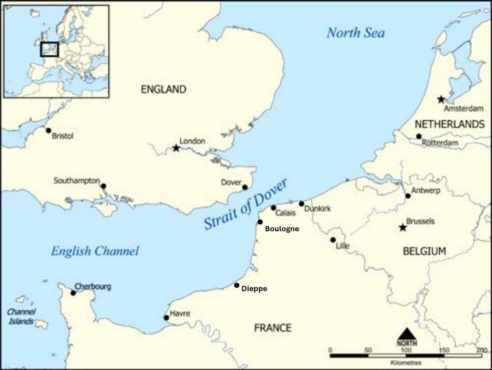

# ClearingtheChannelPorts

One of this spring’s tours was to follow the Canadians as they fought
their way north from Normandy to clear the channel ports to reduce the
logistic trail. Specifically, I looked at Thomas Easton of the Queens
Own Rifles and their fight for the Channel Ports. Some time ago, I
posted about [Lance Sergeant Thomas
Easton](https://www.paulsbattlefieldtours.com/post/lance-sgt-thomas-easton)
who landed on Juno Beach on D-Day and fought his way north to Boulogne.
Thomas’ family is from Hornepayne, ON, where my eldest sister Diane
lived for most of her life. This is another underappreciated phase of
heavy fighting involving the Canadians.

# Breakout from Normandy

After the Falaise Pocket was closed on 21 August, it is estimated that
the Germans suffered 450,000 casualties, 240,000 killed or wounded and
210,000 taken prisoner. The Allies had 209,672 casualties among their
ground forces, including 36,976 killed and 19,221 missing. The Canadians
suffered 18,000 casualities over this period, with 5,000 killed and
13,000 wounded.

Logistics was becoming a major issue since all supplies were still being
delivered through Normandy. It was costing 3 gallons of gas to deliver 1
gallon to the front line. The Canadians were on the western edge of the
advance so were given the task to clear the Channel Ports so supplies
could be delivered closer to the current troop locations.

The French ports of Le Havre, Dieppe, Boulogne and Calais were all
assigned as priorities for the Canadians. The Germans also recognized
the importance of the ports, so on 04 September, Hitler declared the
ports to be fortresses that were to be defended to the last man.

Dieppe had been abandoned on 01 September, before the Hitler decree, so
the Second Canadian took Dieppe unopposed. It was fitting that
2nd Division would take Dieppe, as they were the Division
descimated during the disaterous raid on Dieppe in August 1942. The
ports at Dieppe had only been partially destroyed, so the first ships
arrived on 06 September. Dieppe was able to provide 25% of the British
21st Army Group requirements.

The I British Corps, assigned to the Canadian Army took Le Havre on 12
September after 48 hours of heavy fighting. Le Havre was heavily bombed
prior to the ground assault, causing the death of 2,000 civilians and a
handful of Germans. Le Havre was the largest of the Channel ports,
second only to Mariseilles in shipping capacity. After 2 days fighting,
the garrison of 11,000 German soldiers was captured at the cost of less
than 500 casualties. Unfortunately, the port facilities were heavily
damaged, and the port was not operational until 13 October. Le Havre
became an important port for the Americans but did not help the British
supply effort.
