# LiberatonoftheNetherlands

# 8th Hussars and the Argylls

Rachel’s buddies Janaya and Beth were visiting for the weekend, so I
took the opportunity to follow my Uncle Norm of the 8th
Hussars of the 5th Armoured Division, and my great uncle
George of the Argyll and Sutherland Highlanders of Canada of the
4th Armoured Division, through the final stages of the war.

The 3rd Division went up the western side of the Netherlands,
the 2nd Division went up the middle and were replaced by the
5th Armoured Division and the 4th Armoured
Division went into Germany supporting the Brits.

# The Grebbe Line

In looking at the maps of the Liberation of the Netherlands, I wondered
why the Canadians didn’t liberate Amsterdam and Rotterdam. Turns out, a
secret agreement was made with the Germans not to cross the Grebbe line
to avoid heavy military and civilian losses and the destruction of
Western Holland.

The Grebbe Line had been first established in 1745 to defend western
Holland from invaders. The line runs about 40km from the IJsselmeer
(then Zuiderzee) to the Rhine River. Defensive fortifications run along
the line and several areas could be flooded to deny access to the
invaders. There was a plan to more heavily fortify the line before the
war, but funding and resources were not made available. The Dutch held
the line for 3 days as the Germans swept through the low countries.

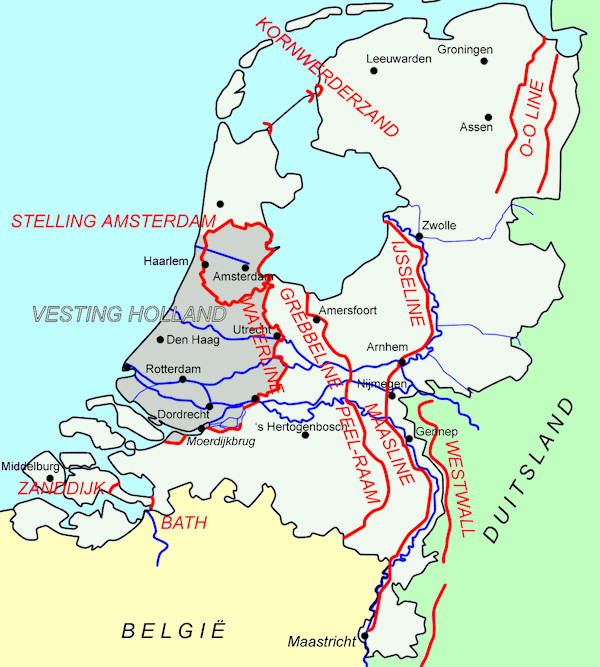

The Germans greatly strengthened the defences so the Allies would have a
very difficult time cracking the line and freeing the major cities of
Utrecht, Amsterdam and Rotterdam. The Germans were under orders to fight
to the end, but the German General Seyss-Inquart, realizing the war was
almost over, entered into secret negotiations to avoid fighting and
severe loss of life of both the combatants and the civilian population.
To demonstrate the potential catastrophe, he opened a single dyke and
flooded 75 square miles. He then warned that if the Canadians attacked
beyond the Grebbe Line, he would blow another dyke between Rotterdam and
Gouda, causing massive flooding all the way north to Amsterdam—
effectively destroying western Holland. The Allies agreed not to cross
the Grebbe line, so western Holland was not liberated until the formal
German surrender on 05 May 1945.

## Starvation Winter

The winter of 1944 – 1945 had been especially harsh and the Dutch
population was on the verge of starvation. Tens of thousands of
civilians had already died from starvation and the cold. The Canadians
negotiated a separate cease fire to deliver food to the starving
population. Operations Manna and Chowhound were raised to airdrop food
to the population and the Canadians quickly established convoys to
deliver additional food and supplies.

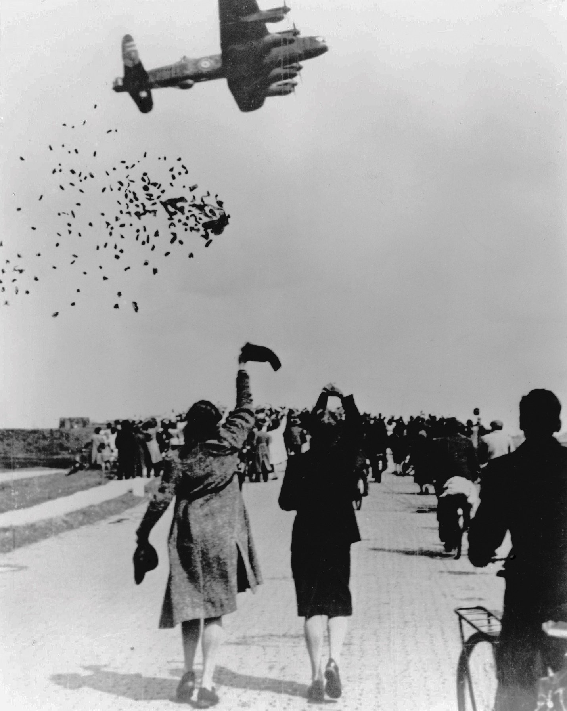

In late April and early May, the Allies flew more than 3,300 sorties
dropping 6,684 tons of food to the starving population of the still
occupied region of the Western Netherlands.

Ground crews loading a Lancaster bomber.

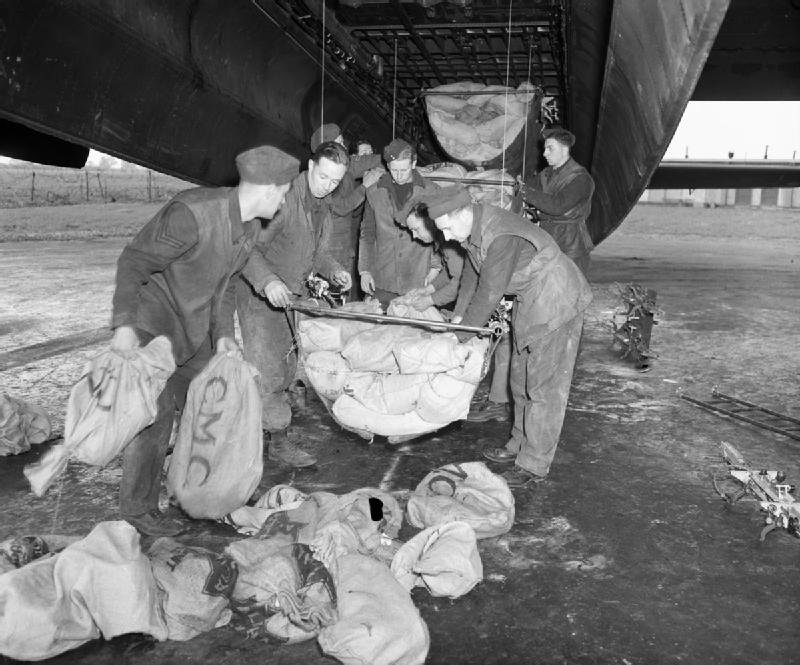

Approximately twenty thousand Dutch died from starvation. Three times
the number of babies died in the first five months of 1945 as in the
same period in 1944, and twice as many children between one and five
years old succumbed. The occupation claimed many other Dutch lives. Of
the 120,000 Jews sent to the extermination camps, 104,000 perished. Air
raids killed 23,000, more than 5,000 died in prisons and concentration
camps, 2,800 were executed, and of the 550,000 men taken to Germany as
forced labourers, 30,000 never returned. The Dutch government concluded
that from a population of 8.8 million, the war claimed 237,300. The
country itself had been laid waste. Most everything in the way of
factory equipment, vehicles, rail stock, shipping and barges, and
livestock had been carried off to Germany. Even the ubiquitous bicycles
had been halved from a pre-war number of four million.

These numbers would have been much greater if it hadn’t been for the
military and humanitarian intervention of the Canadians.

The Canadians paths north.

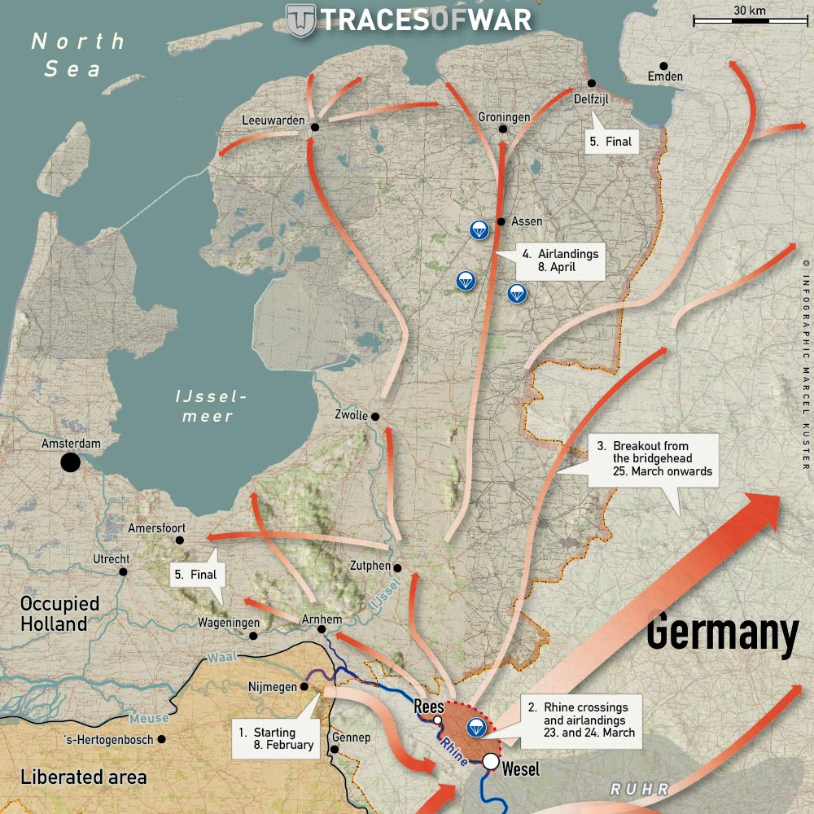

# 8th Hussars

My Uncle Norm Kightley was a with the 8th Hussars. By this
time in the war, he was a sergeant and tank commander.

The 8th Hussars had arrived in Belgium in February 1945 from
a long Italian campaign, but it was not until mid April that they moved
back into action in the Arnhem Area. The map shows the progress of the
Hussars (red) and the Argylls (blue). An [interactive
map](https://pd-allen.github.io/docs/Argylls&Hussars.html) is available
to see the daily progress of both units. Click on a specific point to
get the daily information. The Hussars map covers the period from 15
April until the end of the War, and the Argylls map covers the period 28
Oct 1944 (when Uncle George joined the unit) until the end of the War.

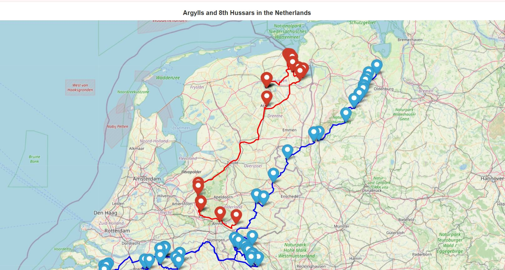

## Otterlo

The 5th Armoured Division had been steadily pushing north
with relatively little resistance. The village of Otterlo had been
liberated by Canadian forces as part of this offensive.

However, remnants of German forces, primarily composed of SS troops and
Fallschirmjäger (paratroopers), were retreating through the area from
the Veluwe region and were desperate to break out and regroup. The
Germans launched a surprise counterattack with approximately 1000
troops. The Canadians were taken off-guard and bitter street fighting
broke out with hand-to-hand and bayonet combat. The arrival of the
flame-thrower tanks and artillery turned the tide and inflicted heavy
casualties on the Germans. The Germans suffered approximately 300
deaths, with the Canadians suffering 17 killed and 43 wounded. The
Battle of Otterlo is notable for its unexpected intensity and violence,
occurring so late in the war when German resistance was generally
collapsing elsewhere.

It is remembered locally as a dramatic and heroic last stand, with
significant loss of life despite being a relatively small battle in the
broader context of World War II.

There are a number of memorials to the 5th Division in
Otterlo. This one states

1945-1995

50 years of Liberation

Otterlo 16 April 1945

Liberated by

5 Canadian Armoured Division

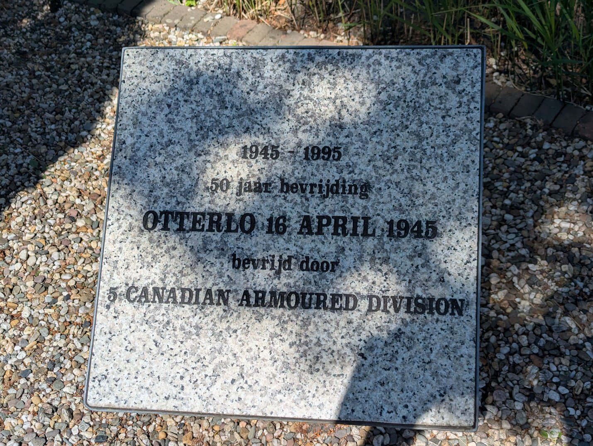

I visited just after Liberation Day 05 May, so a number of wreaths were
present.

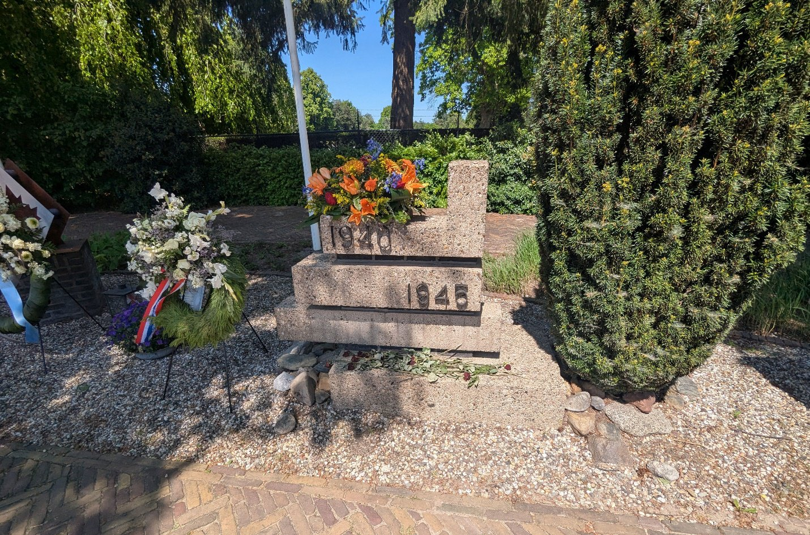

There is also a memorial to the fallen.

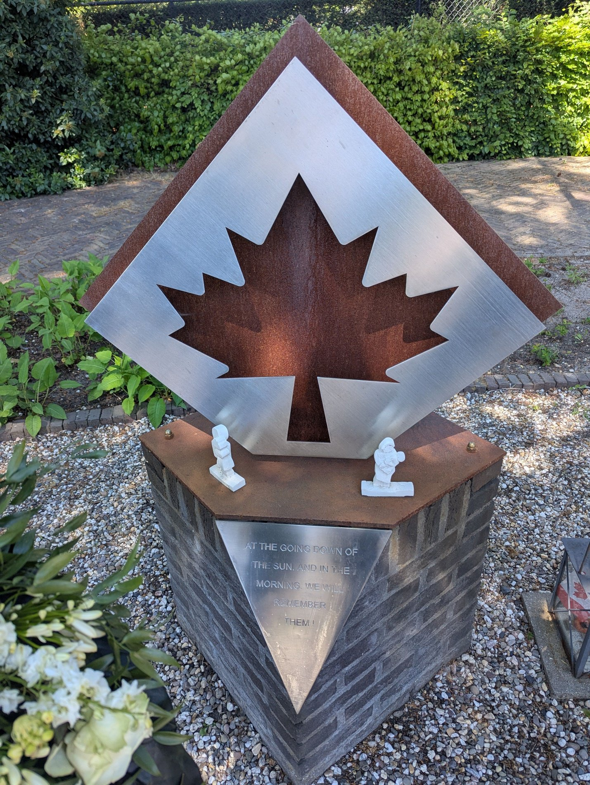

As well as a tribute to Major General Burt Hoffmeister, commander of the
5th Armoured Division.

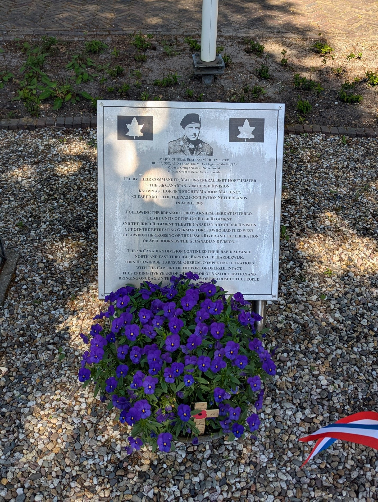

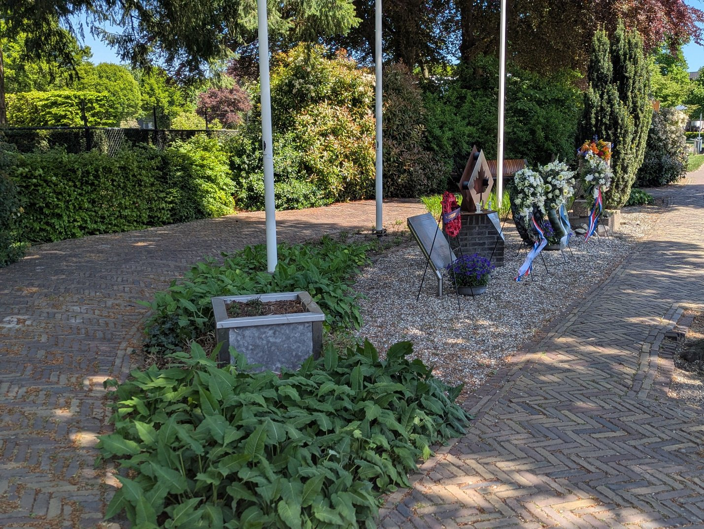

Lining the streets around the memorial, all of the fallen are
commemorated on banners, a very touching remembrance.

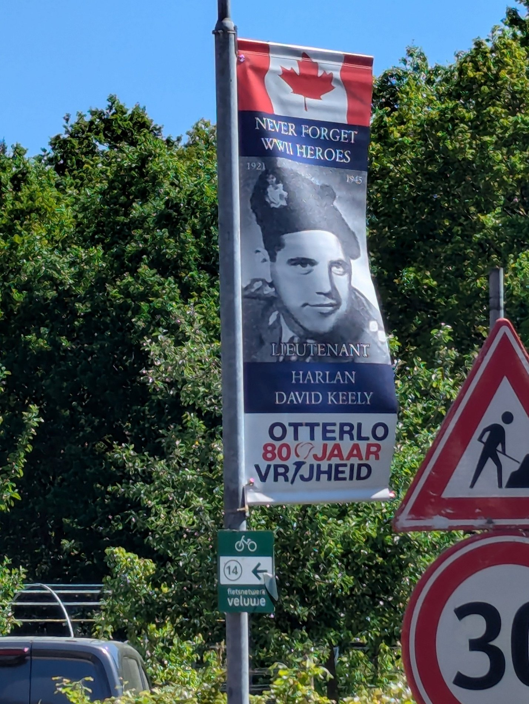

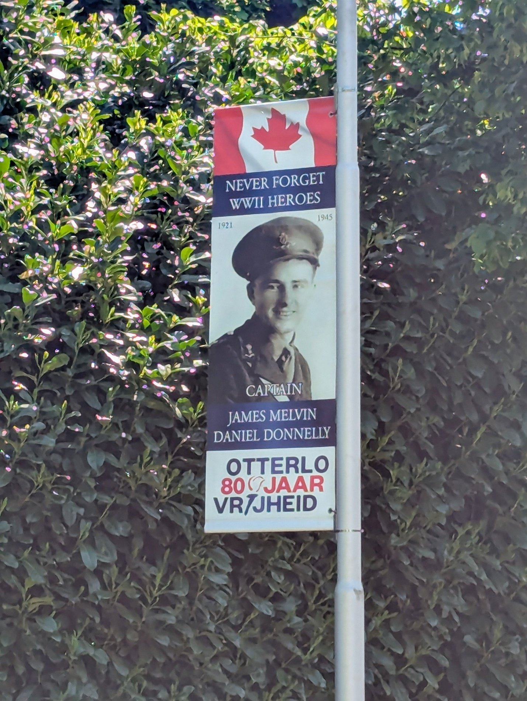

## Putten

Arnhem fell on 14 Apr, and the Hussars prepared for a push to Putten as
part of Operation Cleanser. The push to Putten was largely an Armoured
advance, with the infantry following behind clearing up pockets of
resistance. The Germans fought fiercely, and A Squadron lost 12 of 17
tanks, but amazingly only 1 soldier killed. There was a small band of
Dutch SS troops who joined the German forces. They fought to the death
rather than face the wrath of their countrymen after the war. The
Hussars advanced over 30 miles in 4 days fighting as an armoured unit
free to make major advances across flat lands. Their push to the sea
split the German forces in Holland in two. The 5th Division
only suffered 76 casualties in total while capturing more than 1700
prisoners.

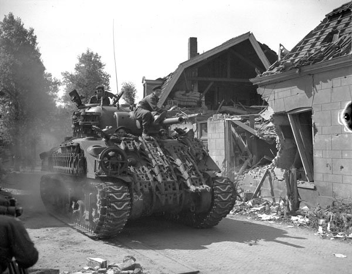

**<u>Hussar Firefly entering Putten in April 1945.</u>**

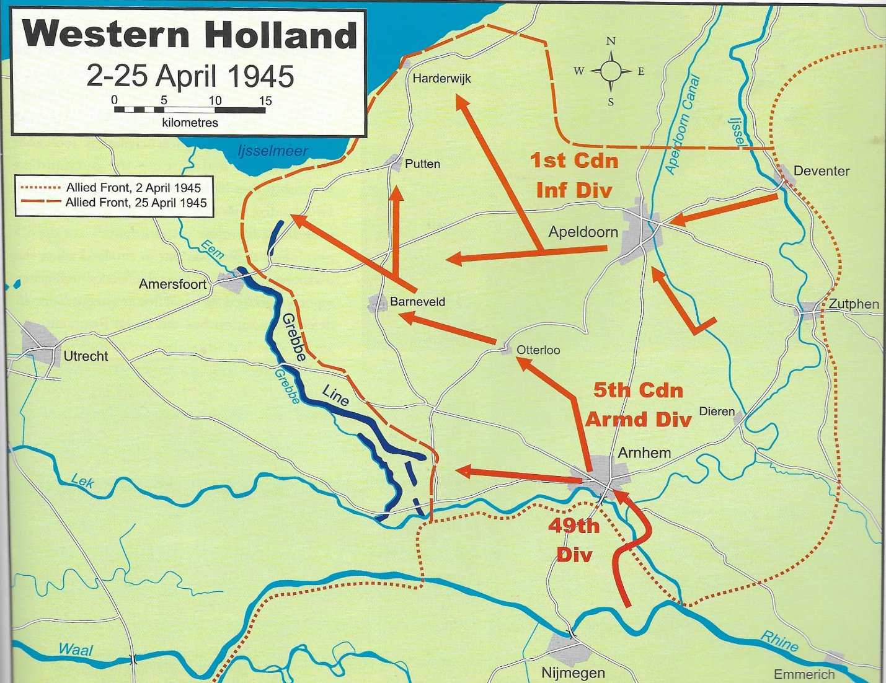

There is a memorial to the soldiers lost during the fighting at Putten.

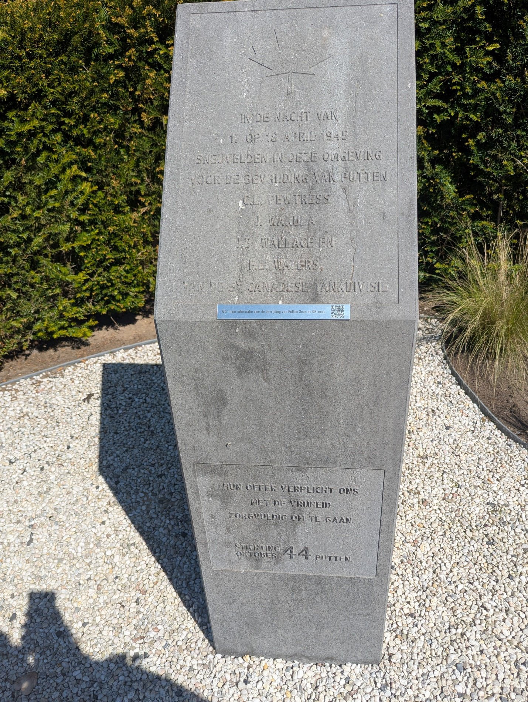

'IN THE NIGHT OF  
17 and 18 APRIL, 1945  
FALLEN IN THIS AREA  
FOR THE FREEDOM OF PUTTEN  
C.L. PEWTRESS  
J. WAKULA  
J.B.WALLACE EN  
F.L. WATERS  
  
OF THE 5TH CANADIAN TANK DIVISION'

After a few days’ rest, the Hussars pushed north to Assen, completing
the 174-mile trek in a single day.

## Delfzijl – The Final Fight

After a few days rest in Putten, the Hussars moved north, their target
the port city of Delfzijl, the northernmost point of the Netherlands on
the border of Germany. Delfzijl, with a pre-war population of 10,000, is
one of the largest of the secondary ports of the Netherlands. It is
located on the left bank of the Ems estuary, some 20 miles from the
river's mouth. Topography hampered operations in this area. The ground
was flat with very little cover and "a complicated network of ditches
and canals made cross-country movement impossible. The weather was wet
and the whole area subject to flooding, which meant that all vehicles
were confined to roads."

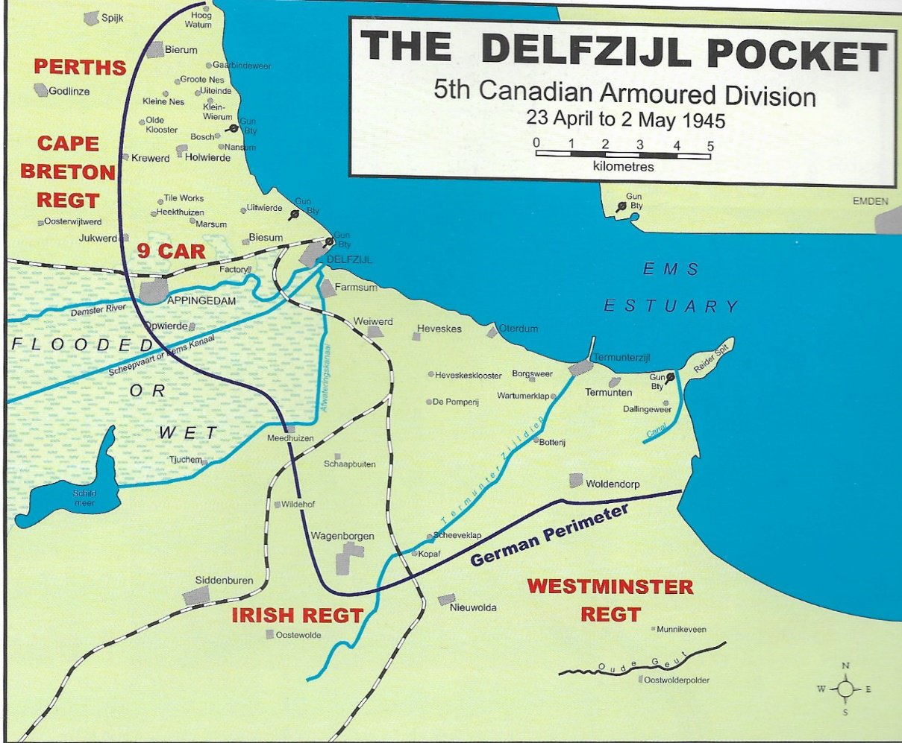

It was essential to capture the port intact as it would be critical for
providing supplies to the starving Dutch people. Delfzijl was heavily
defended and surrounded by low lying land that provided no cover for the
attackers. The 5th Division created a semi-circle around the
city. The infantry could only move forward at night, with the tanks
providing covering fire. Due to the swampy conditions, the tanks were
forced to stay on the roads and made easy targets. The 8th
Hussars provided support for the Infantry Units executing the assault.
There were tanks with the Westminsters, Irish Regiment, Cape Breton
Highlanders and the Perth Regiment, so the Hussars surrounded the town.

The German garrison was estimated at about 1500 fighting troops with
batteries and concrete emplacements in and around Delfzijl and "an outer
perimeter of wire and a continuous trench system" surrounded the port.
Heavy naval guns near Emden and on the island of Borkum could also
provide defensive fire. "The going was slow as the advancing troops had
to deal with mines and road demolitions before they could get any
supporting arms forward." They also endured much shelling, some coming
across the estuary from the vicinity of Emden. Destroyed port guns near
Delfzijl.

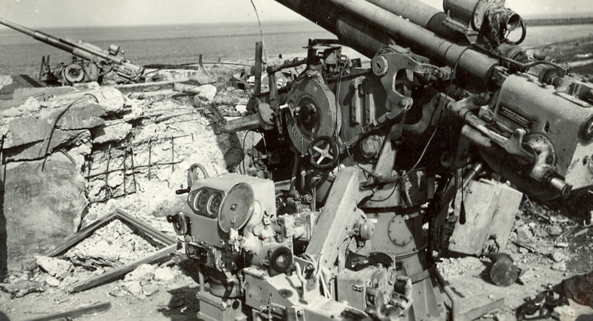

Uncle Norm’s unit, B Squadron of the 8th Hussars was assigned
to the Westminster Regiment with the goal of shutting down the Battery
east of Delfzijl. They decided to capture the small port of Termunten
first to isolate the battery.

The tanks
had a hard time negotiating the mud, so the infantry slogged through
ditches and waded water-soaked fields. Advancing at night, they made a
slow motioned charge, taking the Germans by surprise. The tanks
struggled through the mud finally joining the infantry and crushed the
resistance of the Germans. Using a pincer movement, the Westies took the
port and captured 500 soldiers standing on the pier awaiting evacuation.

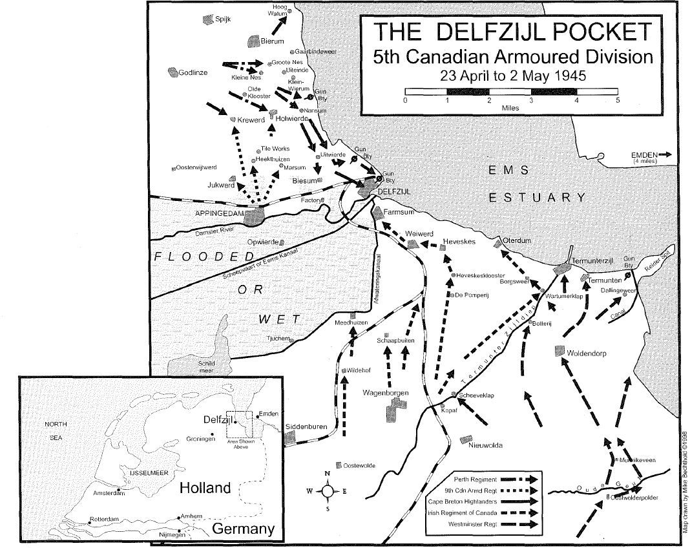

The current day harbour at Termunten.

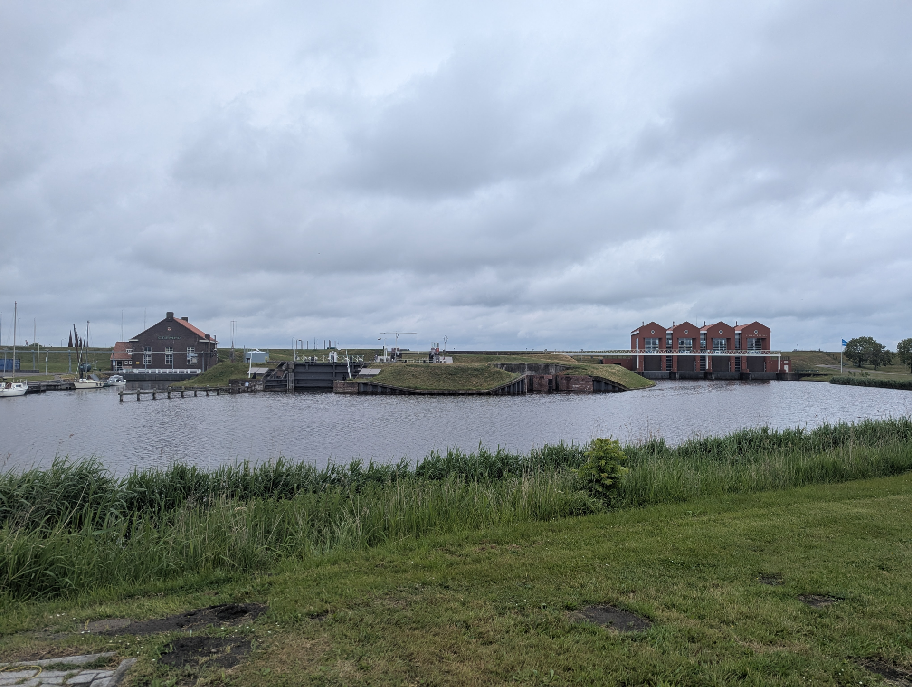

The battery at Fiermel continued to fire on the Westministers, so they
approached along the dyke to formulate a plan to take the Battery. View
along the dyke today.

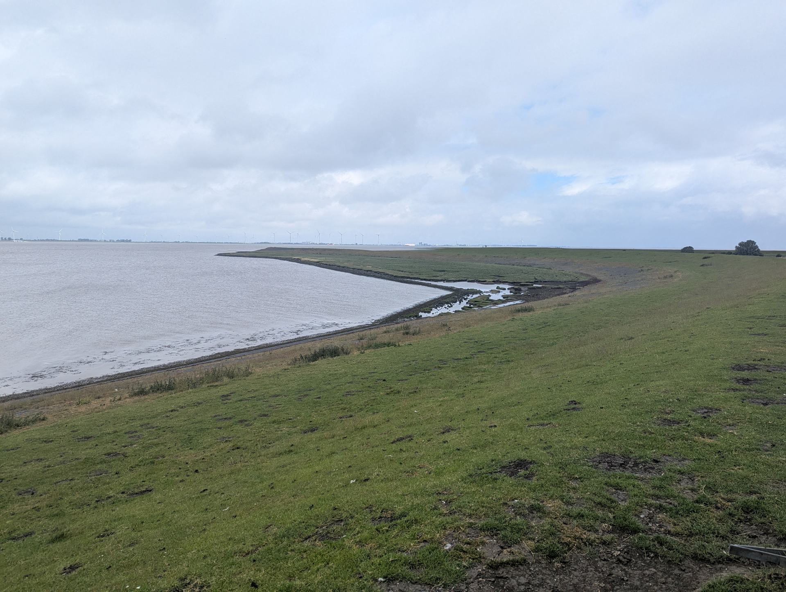

The sheep maintain the grass along the dyke.

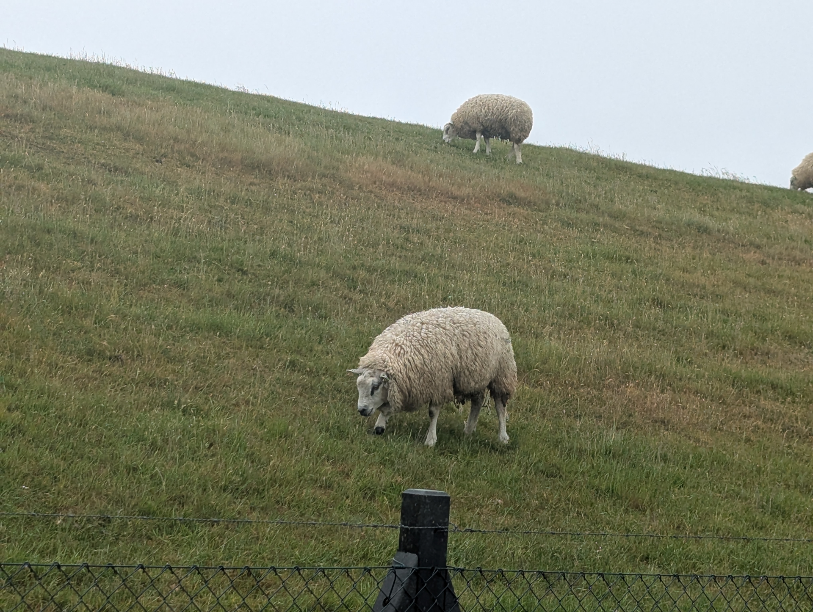

The Battery Fiemel had a collection of 128 mm guns, 40mm cannons and a
collection of bunkers that would be very difficult to dislodge. The
aerial photo shows the battery layout. The circled bunkers are still
present.

An aerial photo from shortly before the battle.

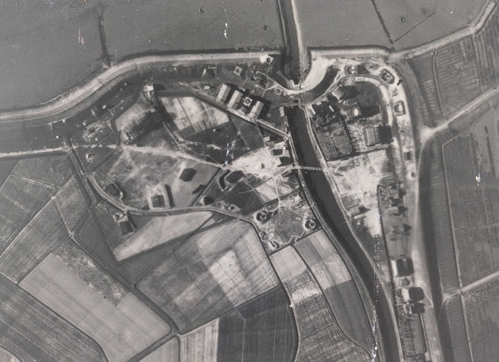

The 128 mm gun was mounted on a storage bunker to easily fire over the
dyke. The gun mounted on the top is a reproduction of the actual gun.

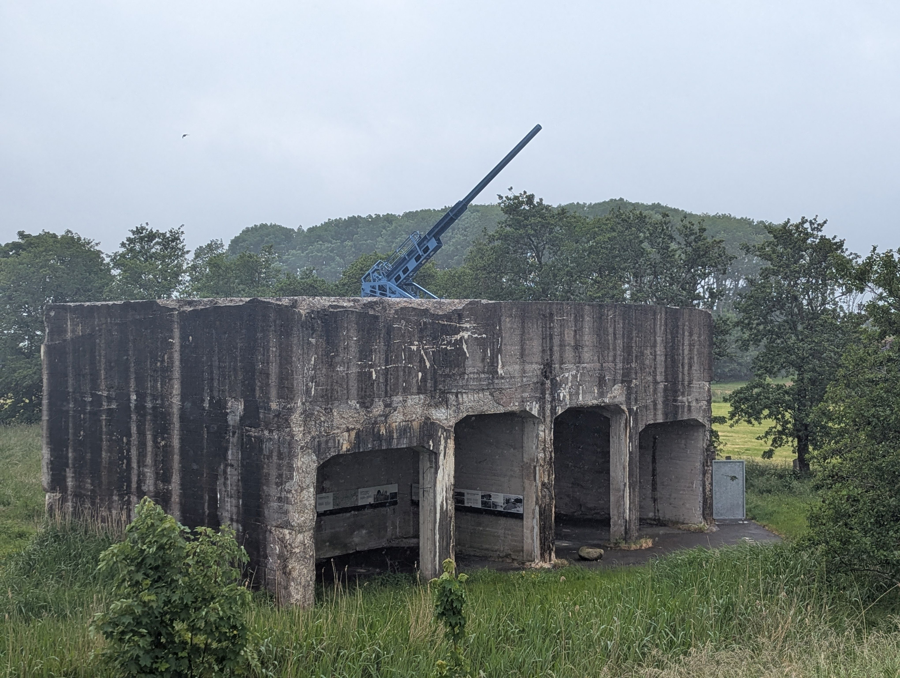

View from the gun position.

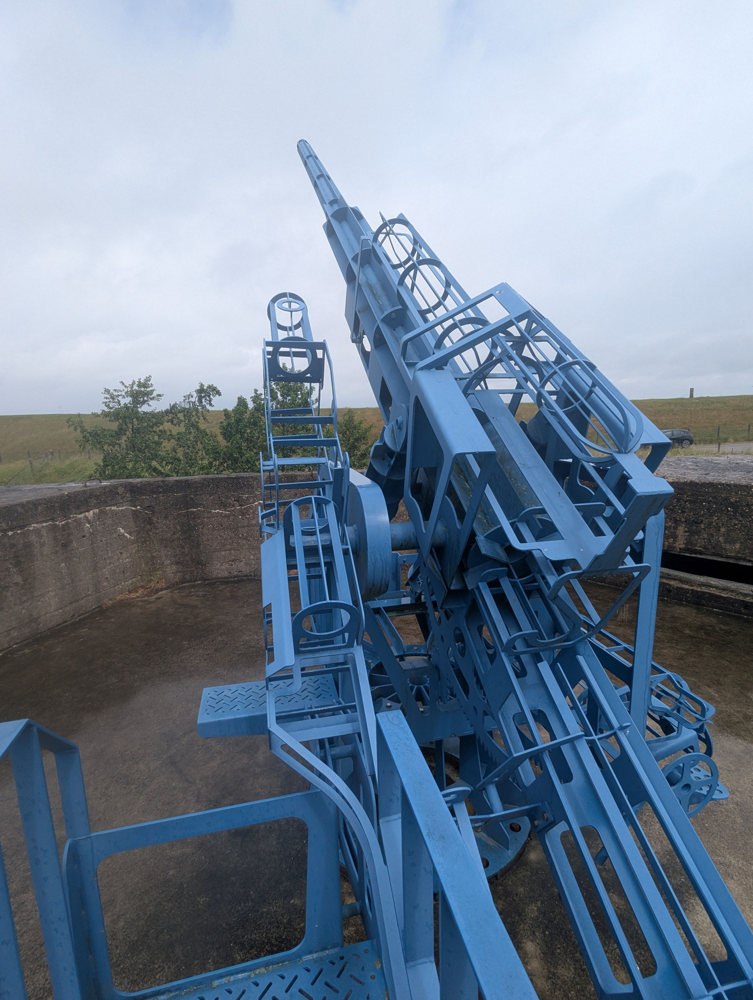

The actual gun after the area was captured. The guns had a range of more
than 10km, so they could reach the port of Delfzijl.

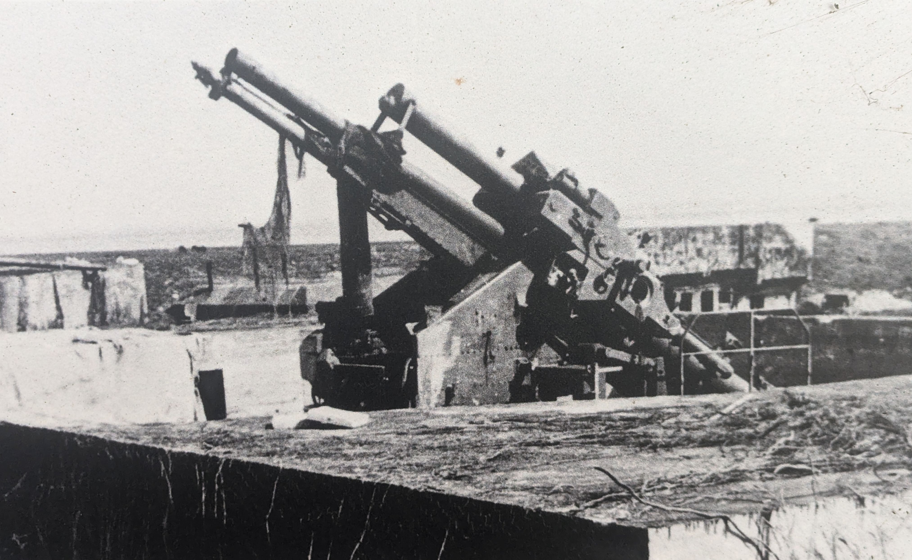

The circled munitions bunker that supported the guns.

Prior to the assault, a deserter, claiming to be a Russian pressed into
German service, reported the Germans planned to abandon the battery. At
midnight all the guns fired in unison, and machine guns strafed the
dyke. At 0300, the guns suddenly went silent, and Westminster patrols
subsequently determined the battery had been deserted. Uncle Norm’s war
was over.

The Cape Breton Highlanders, supported by the 8th Hussars
began the final assault on the night of 30 April. Minefields and wire
delayed the advance as did the thick bunkers. The bunkers defending the
port had reinforced concrete walls 7 ft thick. The standard rounds
penetrated 5.5 ft, but it was only when the new Canadian Sabot round was
used, were the Germans persuaded to surrender. The round is a small
diameter projectile that has a bore riding outer casing (Sabot) that is
discarded after clearing the barrel. The remaining projectile is much
more aerodynamic than the conventional shell, so impacts the target with
much higher energy, permitting deeper penetration.

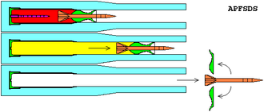

After 9 days of heavy fighting Delfzijl finally fell, on 01 May. Over
4300 Germans were captured throughout the battle, and although the locks
and port facilities were wired for demolition, they were captured
intact. The 5th Armoured Division’s 158 casualties were
lighter than expected.

One of the many bunkers in Delfzijl. This bunker is now part of the
local aquarium.

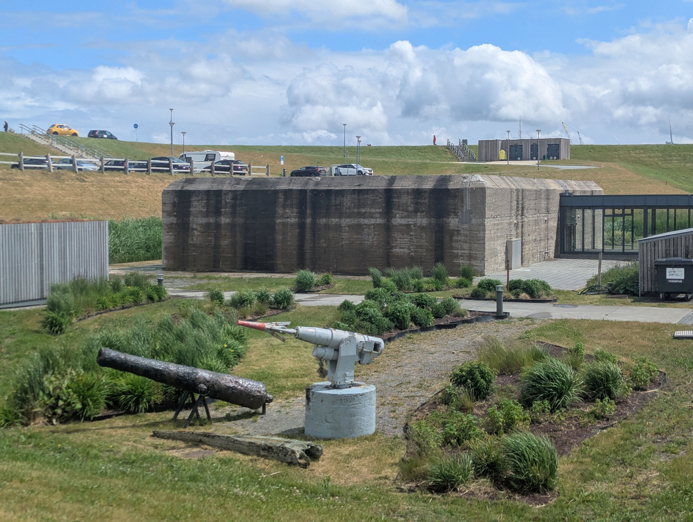

A very interesting reuse of a bunker, but it is a bit odd walking among
the tanks of fish while ducking through low concrete doorways.

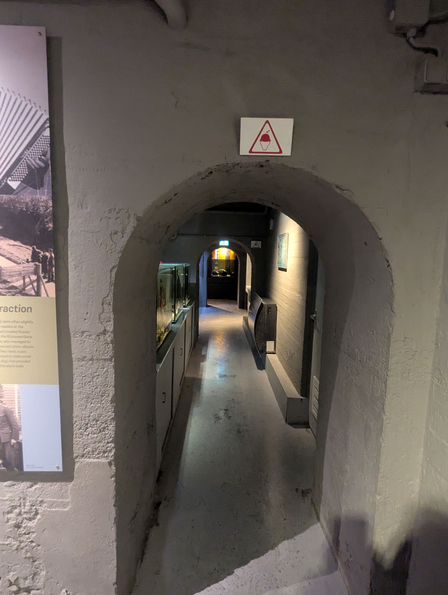

The thickness of the walls is incredible. When they made the entrance
linking the bunker to the main building, it took 3 days to saw through
the 3 m of concrete.

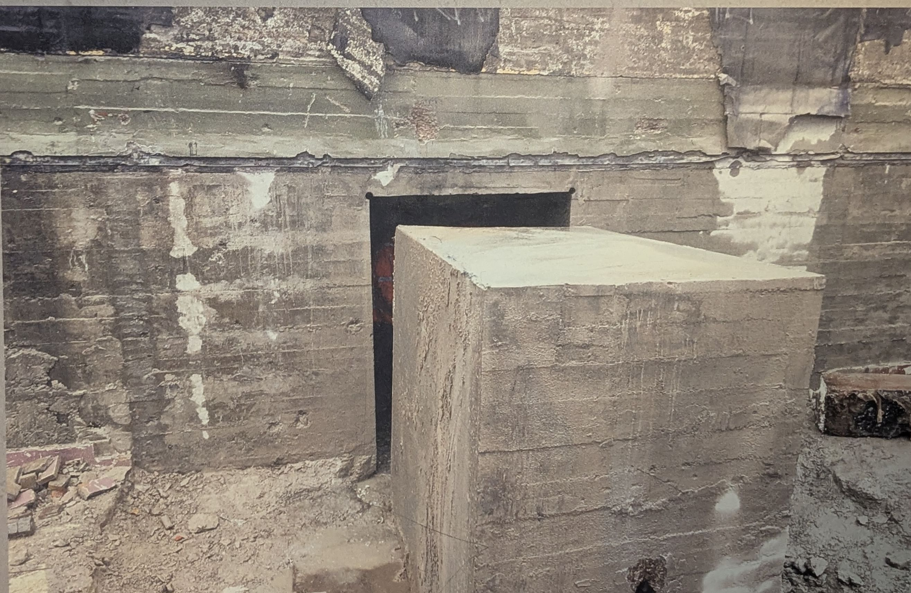

## Eelde

### Post War

After the conflict was over, the 8th Hussars moved to Eelde,
a small village south of Groningen. They were first encamped at Villa
Vosbergen, a former summer estate that had been transformed to a
retirement home and the grounds designated as a walking forest. The
Hussars set up camp in the fields around the estate, before moving into
the town and boarding with the residents.

The villa is now a museum, and the walking trails still a popular local
destination.

Relations with the local population were excellent.

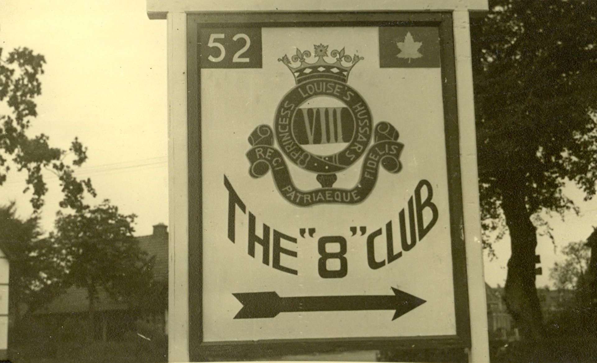

Out of this good fortune a lively social life sprang up, replete with
romances, dances, movies, sightseeing, sailing and swimming, a whole
welter of clubs in the immediate area and in the large nearby city of
Groningen, Dutch Canadian study clubs and all sorts of personal
liaisons. Holland was a good and grateful place to be, and the Hussars
made the most of it.

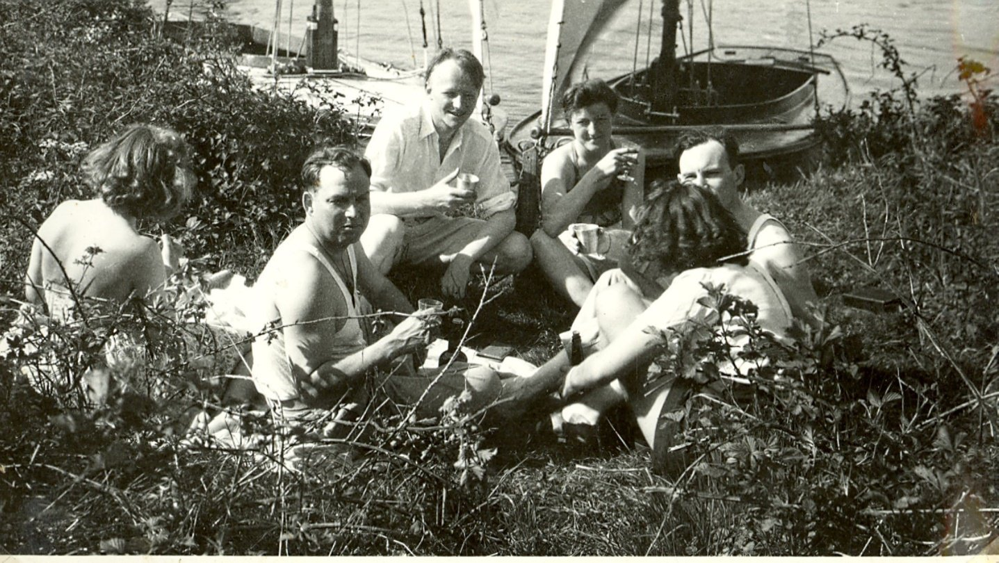

To these boons, headquarters added others in an effort to stave off the
boredom and indiscipline which would inevitably lead to trouble and a
lowering of regimental prestige. There were leaves to England, Paris,
Brussels, and elsewhere, university and other educational courses, a
heavy concentration on sports, and there was enough soldiering to keep
the men smart and on their toes.

As an example of the support provided by the Hussars, the people of
Eelde sadly needed peat for their fires but they had no means of moving
it. So, the Hussars arranged a driver-maintenance course and just by
coincidence it took the trucks out to where the peat was stacked. The
Dutchmen piled it aboard and the troops then drove it back to town for
them. They'd stack it in the town square and dole it out from there.

Out in the lush pastures of Holland, that royal Italian, Princess
Louise, grew sleek and fat and more aristocratic under the lavish
attentions of her Regiment. The Dutch people of Eelde came to call her
"our horse." Once, seeing the men march by, she leaped the fence and
joined them. But normally her conduct was far more regal than that.

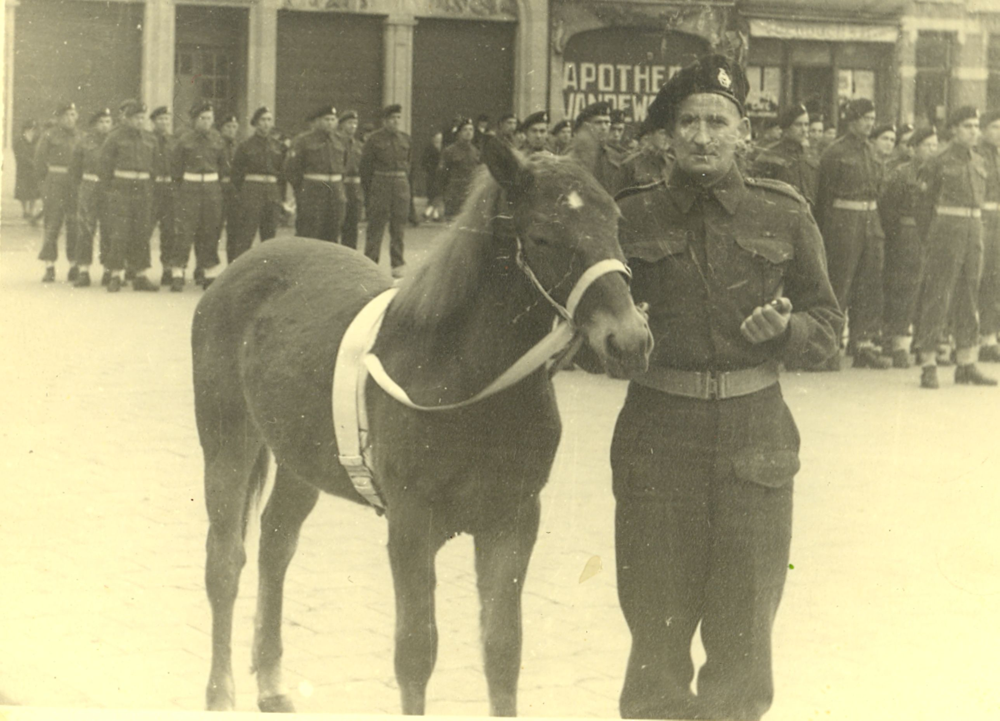

Many of the men were billeted at the Hotel Paterswolde, a lakeside
resort before the war.

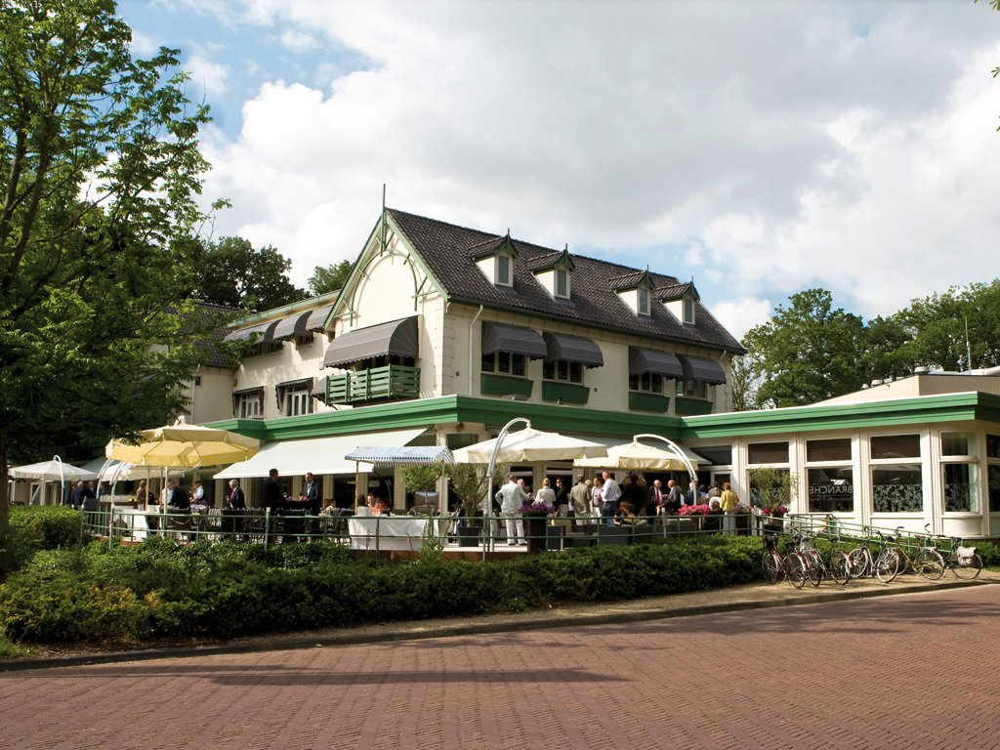

Inside the hotel is a plaque given by the Hussars to the owners. The
plaque was manufactured out of a shell casing and reads:

Presented to

Mr and Mrs E H Heikens

Paterswolde

In recognition of

Kindness shown

To the

New Brunswick Hussars

Canada

April 1945 – December 1945

Brass from 105 mm shell fired at enemy by 8th New Brunswick Hussars.

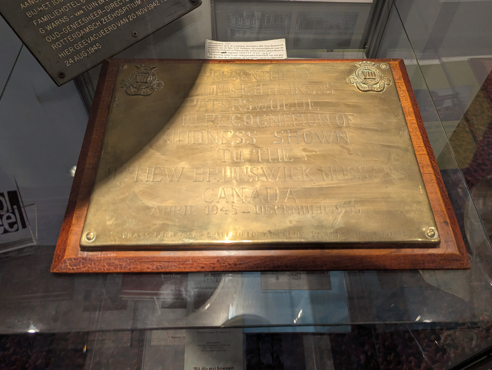

At the 8th Hussars Museum in Sussex, NB, there are a number
of exhibits showing the great appreciation the Dutch had for the
Canadians. The town of Eelde is still twinned with Sussex, indicating
the deep bond between nations.

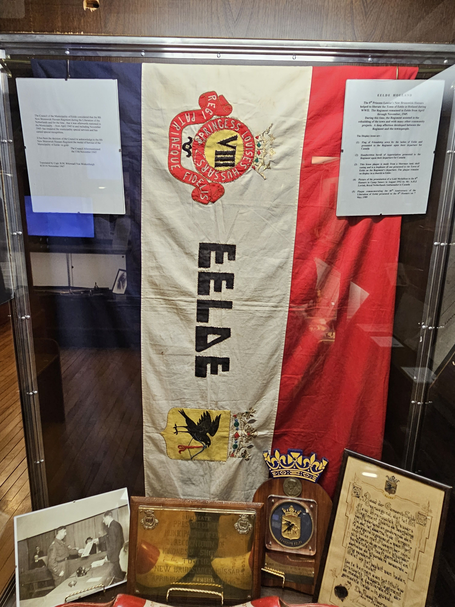

At the end of November 1945, the Hussars got confirmation they would be
leaving. Regimental life once more became ordered pandemonium. In
Paterswolde and Eelde and Groningen, farewells were said to the Dutch
people. In the town hall of Eelde, there was an official farewell, kind
words, an exchange of gifts to seal the months of friendship. The
Burgomaster said, "We'd give you a gold medal of honour, but the Germans
have taken all our gold." Instead, they gave a manuscript bearing
Eelde's official seal. But someday, the Burgomaster said, the thanks of
the community would be said in gold.

The ceremony was followed by an old-fashioned Dutch meal and a formal
dance that went on long into the night before departure. Few Hussars
slept that night. When the last of the Regiment pulled out early on the
morning of Nov. 27, many Netherlands friends were still around to wave
them on their way.

It was a sad farewell. As one Hussar has written:

“In reviewing our stay in this country, it can truthfully be stated that
in every respect it was one of the most pleasant and interesting
interludes in the history of the Regiment.

On 25 May 1952, the town made good on the promise. The Netherlands
Ambassador to Canada visited Sussex, and Lovink presented a medal of
honour as a token "of the great affection" in which the Regiment was
held and as a tribute to its help to a hard-pressed people both in
freeing them and in succouring them through first grim months of
freedom.

Another plaque made of a fired tank shell.

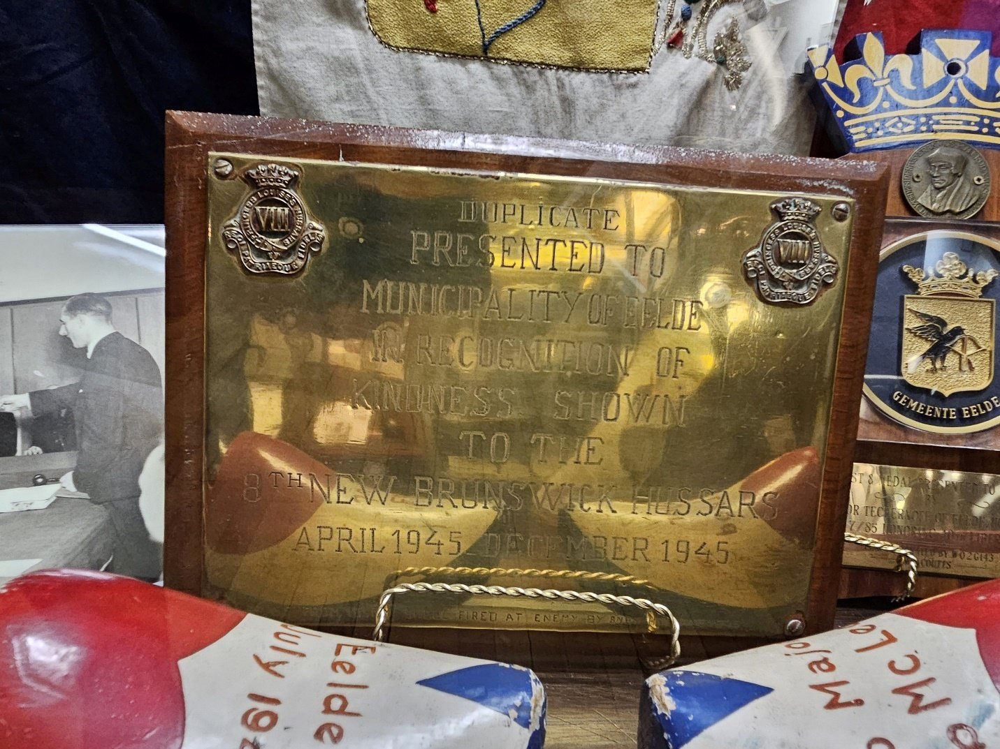

### Final Inspection

The Hussars gathered for a Final Inspection at Eedle, Netherlands on 23
May 1945. The 8th Canadian Hussars were reviewed by General
Crearer, Officer Commanding the 1st Canadian Army,
accompanied by LGen Charles Foulkes and LGen Guy Simmonds,
1st and 2nd Canadian Corps Commander, and MGen
Bert Hoffmeister 5th Armoured Division Commander.

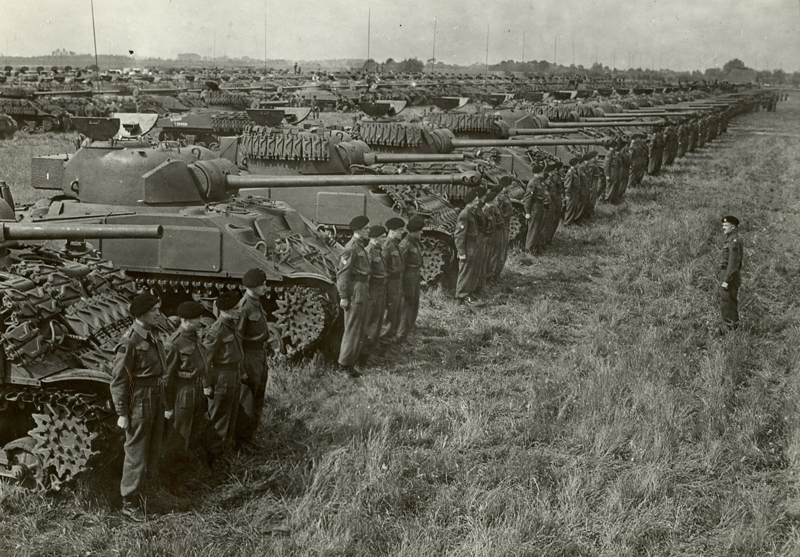

The final drive past of the reviewing stand.

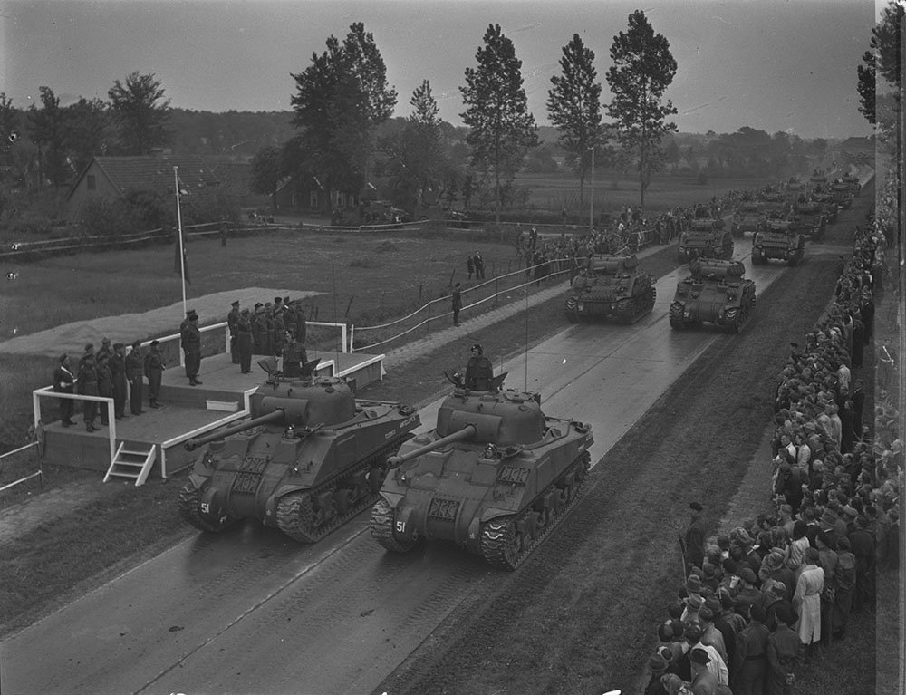

The 5th Canadian Armoured Division together for the final
review.

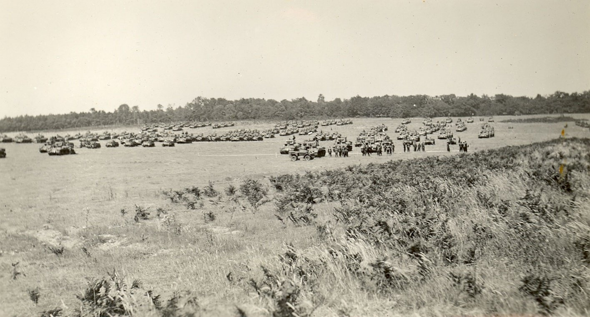

Hussars paying their final respects to their fallen comrades.

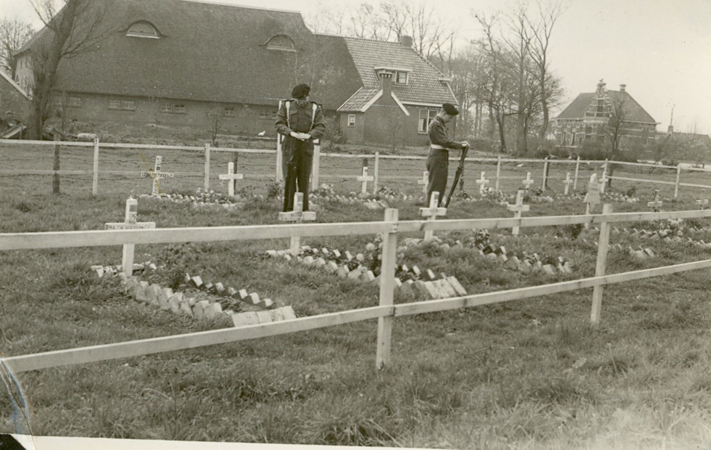

# Argyll and Sutherland Highlanders of Canada

## Early Days

My great uncle George Johnston was 35 when he enlisted on 23 Nov 1942,
at No 2 District Depot in Toronto, ON. He registered as part of the
Canadian Forestry Corps, \#6 Company R Wing. After basic training in
Orillia, he went to Valcartier to train with the Forestry Corps. On 25
Jan 1944 he was posted to \#1 Detachment Canadian Forestry Corps, Balsam
Creek, ON, only a few miles from his farm. He would have been
comfortable working close to home, providing lumber for the war effort.

In July 1944 he was reclassified as Infantry due to the heavy losses in
the infantry ranks since D-Day, landed in England on 06 Sep and was sent
to Belgium on 17 October as part as the 3rd Division Canadian
Infantry Replacement Unit (CIRU). He was assigned to D company of the
Argyll and Sutherland Highlanders of Canada, joining the regiment on 26
Oct at Bergen Op Zoom, part of a draft of 45 men and 4 officers.

The Argyll and Sutherland Highlanders of Canada were part of the
10th Infantry Brigade, 4th Armoured Division. The
Argylls had landed in Arromanches on 26 July 1944, 6 weeks after D-Day,
and had been involved in heavy fighting in Operations Totalize and
Tractable, the Battle of Falaise Gap, Battle of Moerbrugge (Crossing the
Ghent Canal), Leopold Canal, Battle of the Scheldt and Operation
Suitcase before George arrived.

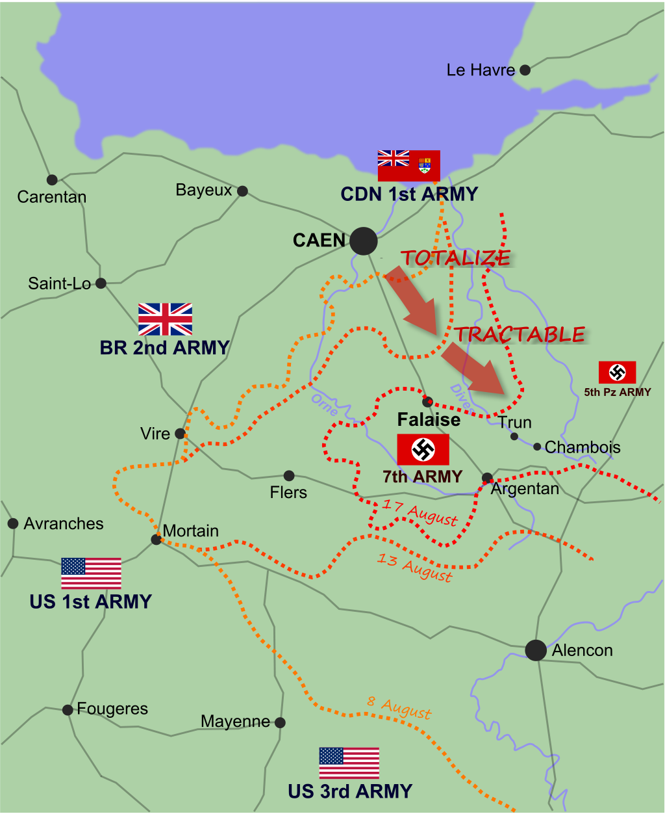

George with his unit. He is in the third row, second from the right.

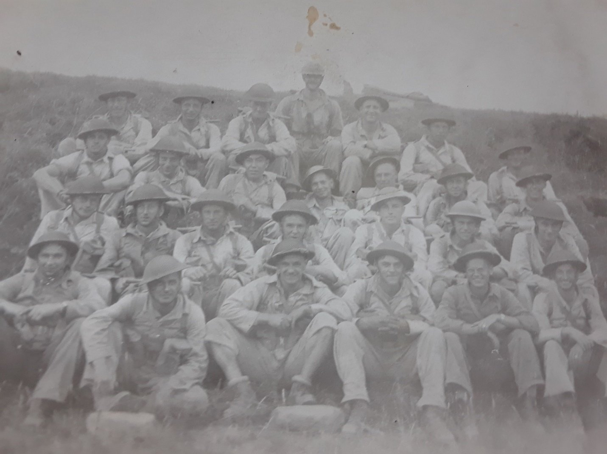

Soon after George joined the unit, they went into an extended rest
period and had very little action for next few months. George was
involved in two major battles, Kapelsche Veer (Operation Elephant) 26-30
January 1945 and the Hochwald Gap (Operation Blockbuster) 26 Feb-10 Mar
1945.

## Operation Elephant

In early January the Germans launched a few small-scale attacks to give
their troops battlefield experience. In late December the Germans had
established an output on the south side of the Maas River, that they
subsequently fortified and strengthened.

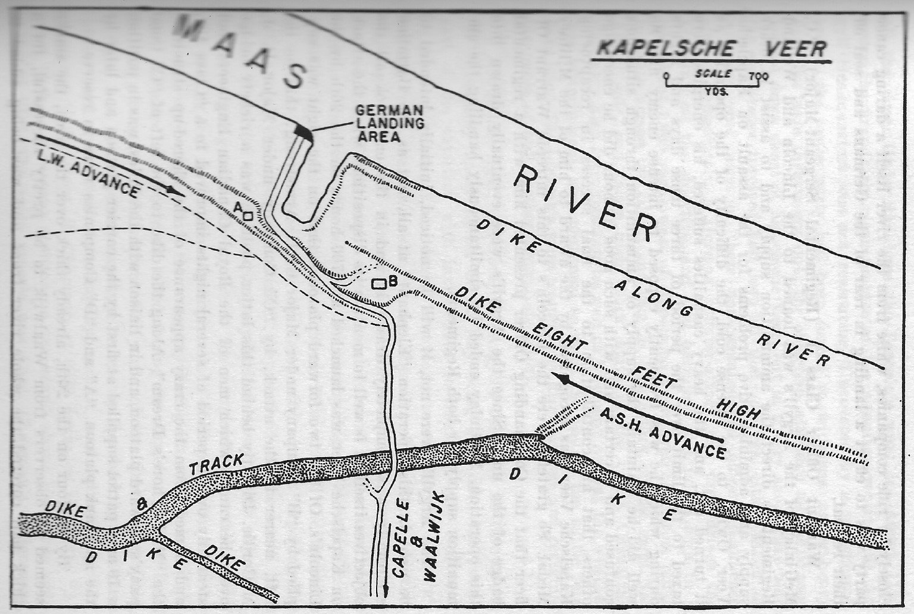

**<u>Kapelsche Veer (Operation Elephant)</u>**

The Poles made several assaults against the German location, but the
well dug in enemy repelled the attacks. The British Royal Marines made
an attempt on 13-14 January, but the exposed nature of the approaches
resulted in a further repulse and 49 British casualties. It was apparent
that a large-scale attack was required, so the 4th Canadian
Armored Division with supporting artillery were given the task. The
Lincoln and Welland regiment, supported by artillery, mortars, Wasp
flame throwers and smoke generators attacked on 26 January. One company
approached from each side, with a canoe party to land behind the Germans
and cut off their retreat. Ice on the river hampered the canoe launches,
and heavy fire from the northern bank sunk several craft. The Germans
held their fire until the last second then counter-attacked furiously.
All officers from both Companies were casualties, the Lincolns
disorganized, so the Argylls joined the fight.

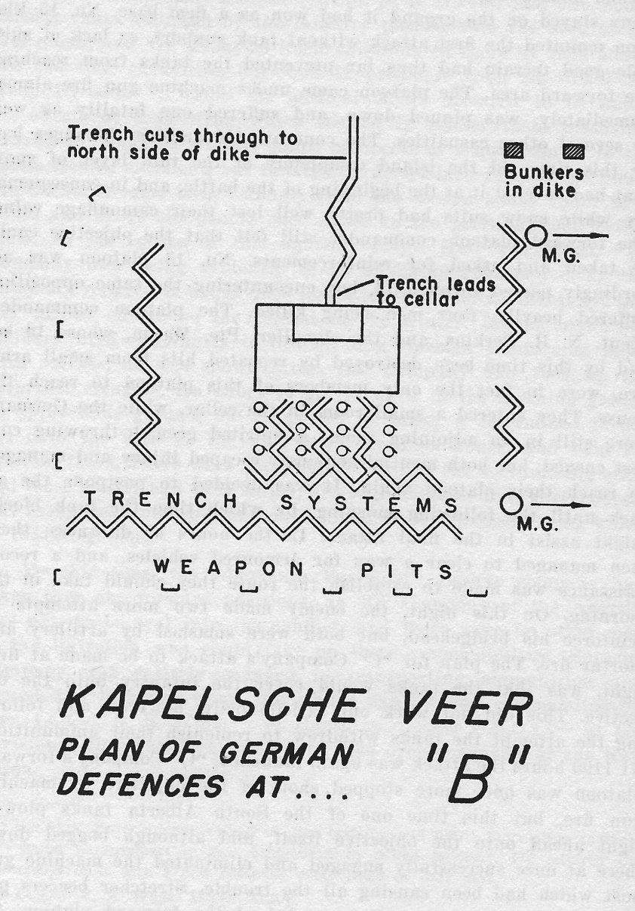

**<u>German Defences</u>**

The Germans were very well dug in and had a series of tunnels that
allowed the defenders to be reinforced from the north side of the river
with minimal exposure. The Canadian Artillery fired over 14,000 shells
into the German positions, but due to the tunnels inflicted relatively
few casualties. The fighting raged on for several days until the Germans
withdrew on 30 January.

The Canadians estimated the Germans lost 145 killed, 64 wounded and 34
captured. The Lincolns had 50 fatalities, and 129 wounded, and the
Argylls suffered 13 killed and 32 wounded.

### **<u>Kapelsche Veer Monument</u>**

A monument to the combatants was erected in 1985, on the 40th
anniversary of the action.

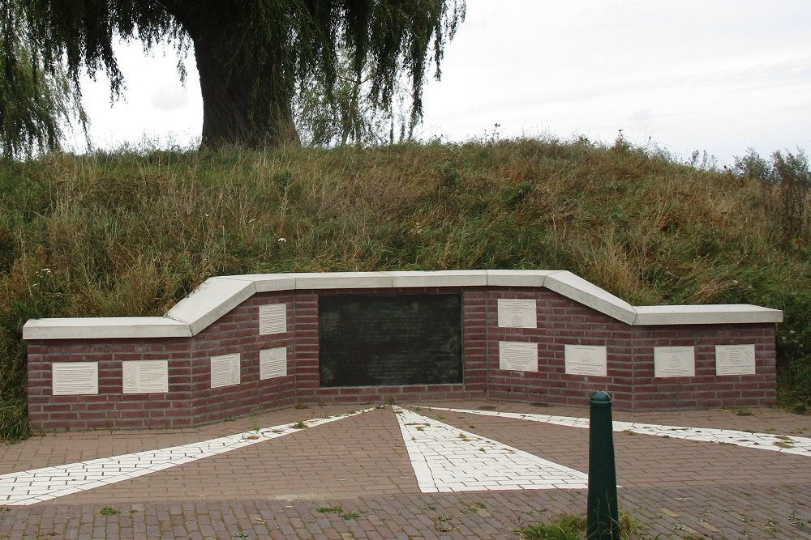

The plaques celebrate the units that fought at Kapelsche Veer, including
the Canadian Units:

> Lincoln & Welland Regiment  
> The Argyll and Sutherland Highlanders of Canada  
> The Algonquin Regiment (Canada)  
> South Alberta Regiment (SAR) Armoured Reconnaissance Regiment  
> The New Brunswick Rangers Machine Gun Regiment

The Argyll’s plaque states:

> In memory of the 14 Argylls killed and the
>
> more than 30 wounded in
>
> “The grim reality” of “the hard and bitter struggle waged”
>
> On the dyke
>
> January 26-30, 1945

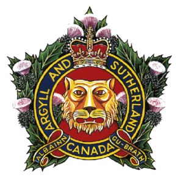

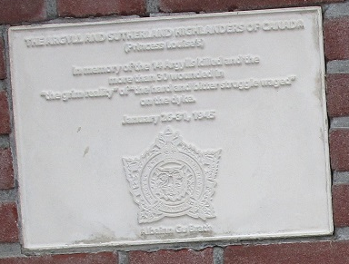

## The Hochwald (Operation Blockbuster)

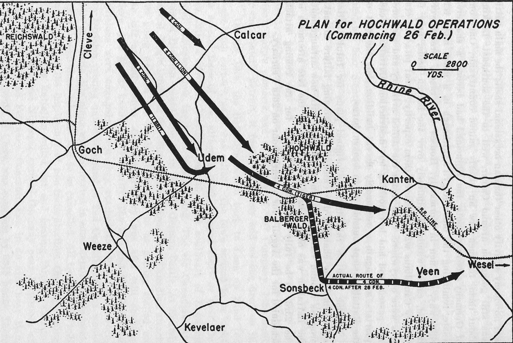

**<u>The Hochwald</u>**

The Battle of Hochwald Gap (Operation Blockbuster) was almost as big as
Normandy, but with three times the number of casualties. The Battle
itself a was masterpiece of defensive combat by Germans who intimately
knew their own territory and set up one tank trap after another.
Outnumbered hopelessly, the German fought about as well one could
expect.

Operation Blockbuster was a major armoured assault to the town of Wesel
on the bank of the Rhine River in preparation to the final push to
Berlin. The attacking force included the 2nd and
3rd Canadian Infantry Divisions, 4th Canadian
Armoured Division, 2nd Canadian Armoured Brigade
2nd Army Group Royal Canadian Artillery and the British
11th Armoured and 43rd (Wessex) Divisions. The
assembled force included 90,000 infantry, 1300 artillery guns and over
1000 tanks, most attached to the Canadian 2nd Division. They were facing
a force of 10,000 with 100 tanks and a few anti-tank weapons tanks
including forces from the 2nd Parachute Corps and 47th Panzer Corps. The
attack would head south from Kleve, then split and head East through the
Hochwald Gap and on to the Rhine. There were few roads in the area, and
the ones that were available were not in good condition. There were
multiple German strong points built as part of the Siegfried Line, as
well as wide anti-tank ditches, heavily mined and booby-trapped areas.
The 2nd and 3rd Division would push to Udem, then
the 4th Division would take the lead and push through the
Hochwald Gap to the Rhine.

The Argylls started off at 1800 hours on 25 February. The plan was to
head cross country in 4 lines, but heavy rain had softened the ground,
and the tanks churned up the earth resulting in many of the armoured
carriers becoming stuck and disabled. With a great effort, the Argylls
were in place awaiting the attack of the remainder of 2nd
Corps. Many of the tanks were bogged down, some buried up to their
turrets.

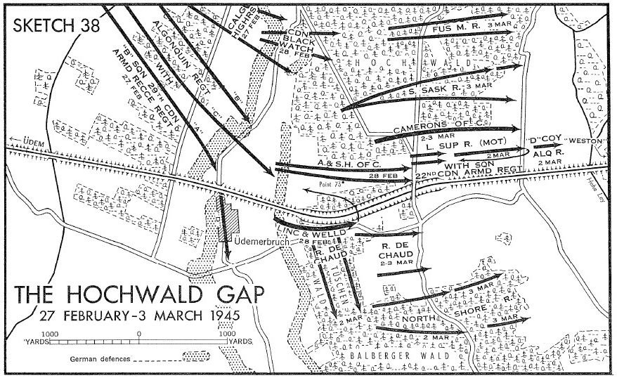

At 0230 on 28 February, the Argylls advanced, and remained under heavy
artillery and mortar fire, and repeated counterattacks by the German
forces. B company was cut off and spent the entire day in direct combat
with the enemy, unable to be resupplied or to evacuate the wounded. At
2000 tanks and units from the Lake Superior and Algonquin Regiments
moved forward finally breaking through the Hochwald Gap. By this time B
company had been reduced to 15 men after holding their position for 24
hours. Over the next two days 54 reinforcements were received as the
Argylls rested while the battle raged on in front of them.

## George Johnston Captured at Veen, Germany 7 Mar 1945

Sonsbeck fell to the Regina Rifles on 05 March, and a firm plan was at
last evolved under which the Argyll's and South Alberta's would push
east from the town toward Veen and take that place. The force started at
2000 hours on the 6th along the main road, the weather, and the country
both wet. The latter was very flat and sparsely wooded, with a good many
houses, mostly stone farm buildings. Tanks could move only on the roads
and as craters abounded progress was slow. Mines were strewn everywhere,
and a tank was blown up soon after the start. By noon about half the
distance to the town had been covered; there was some mortar fire and
sniping, but no stiff resistance yet. A few stragglers were taken
prisoner; they said the only Germans in Veen were a few infantry. After
1400 hours, "B" and "C" Companies advanced to the vicinity of a
crossroads about 800 yards from the town, where a storm of fire from
small arms, mortars, and high -velocity weapons forced a halt . The men
tried to dig in but mostly had in the end to huddle in the ditches, as
the wet country made digging a farce and in any event the place was
swept with singing bullets. A tank was destroyed by an 88 and another
hit a mine and was immobilized. Lieut. Cleroux was killed by mortar
fire. The ground between this spot and the town was quite open so it was
fruitless to advance across it in daylight. In addition to fire from the
town the space was enfiladed by a line of houses to the northwest, and
the mortar fire grew steadily in volume, coming apparently from a large
wood about a mile north of Veen. For the moment, all that could be done
was to sit and endure it.

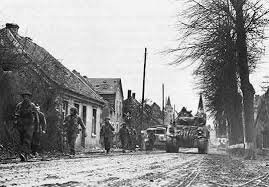

At last light, "B" Company, still under Capt Perry, and "D" Company with
tanks went forward into Veen. Both companies reached the southern
outskirts of the town, at which point they were very closely and
effectively engaged, chiefly by machine guns. The terrain prevented
tanks from getting close and contact between them and the infantry was
soon lost. One platoon of "B" missed its way in the black night and the
confusion and took no part in the fight. On the left, "D" Company could
make no headway worth mentioning and was eventually ordered by the
Colonel to withdraw. The same message was sent to "B", but Capt. Perry
never received it, so he and his two remaining platoons stayed where
they were, although the position was manifestly hopeless. At dawn what
was left of the company found itself in shallow pits and ditches still
short of the houses, although as close as 50 yards in some places, the
whole area dominated by German fire from three sides. Movement of any
kind was impossible; ammunition was almost finished. In view of this
situation, Capt. Perry surrendered his little force. With him were taken
Lieuts. Maxwell and Stewart, both badly wounded, and a number of men,
including George Johnston. Lieut Stewart later died of wounds and was
buried by the Germans in the town.

For the period from 26 February to 09 March the Argylls had lost 260 men
killed or wounded, and 31 men taken prisoner. Total Canadian Casualties
number 379 officers and 3395 other ranks. The Germans suffered 22,000
killed and 22,239 captured. The US Army had captured 30,000 prisoners
with 16,000 casualties.

## Stalag XIb

The Argyll Prisoners of War were taken to Stalag XIb in Fallingbostel,
Germany. At the end of 1944 more than 100,000 prisoners were detained in
the Fallingbostel area. As the war progressed, conditions continually
grew worse, with overcrowding, lack of medical facilities, poor sanitary
conditions, and increasingly meagre rations. The NCOs were forced to
work as well, expending more energy. The daily menu was ersatz coffee
(made with acorns or soy products) for breakfast, thin vegetable soup
for lunch, black bread, and ersatz tea for dinner. Initially the men got
a bit of sausage or cheese with their daily bread, but that was reduced
until they just got a loaf bread that was then shared between 6-8
people. The men estimated they were receiving 1000 calories a day, which
dwindled to 500 calories before they were freed.

Description of the Food by one of George’s fellow Argyll inmates:

At noon, we were given about ½ litre of “skilly” which was saltless
watery soup with bits of turnip and pieces of long greens that we called
whispering green grass, after the popular song of the time “Why Do You
Whisper Green Grass”. Occasionally, if you were lucky, you got a small
piece of meat in your can and other days a small, boiled potato was
given as well. Besides this we got a slice of black bread (that
contained wood chips) per day and although we were supposed to get one
Red Cross parcel each per week, we only got one parcel divided by two
men per week, and this issue was only made a couple of times. George
talked about getting mouldy bread and being happy for it. Men shuffled
around the compound with string tied from the toe of their boots to
above the knee to keep their toes from dragging on the ground from lack
of muscle power.

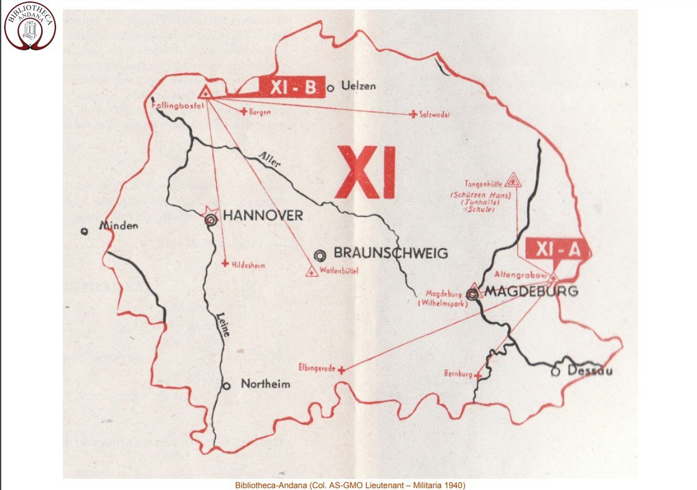

On 16 April 1945 the British 8th Hussars Recce Troop reached
Fallingbostel. The camp had about 6,500 men, some of whom had been
prisoners for 5 years. George spent a little more than a month as a
Prisoner of War, it is amazing that some men survived 5 years in
captivity.

The prisoners stayed in the camp about a week or so until they were
transported by trucks to an airfield not to far away from where they
were flown to Brussels in a DC-3 Dakota. There they were issued new
uniforms, and attended a fabulous banquet served by professional
waiters. Next, they flew to England in Lancaster bombers where they were
given a complete medical check up. On 05 May 1945 George was officially
reported safe in England. George was sent to No 4 General Hospital in
Farnborough near Aldershot, where he remained for a week.

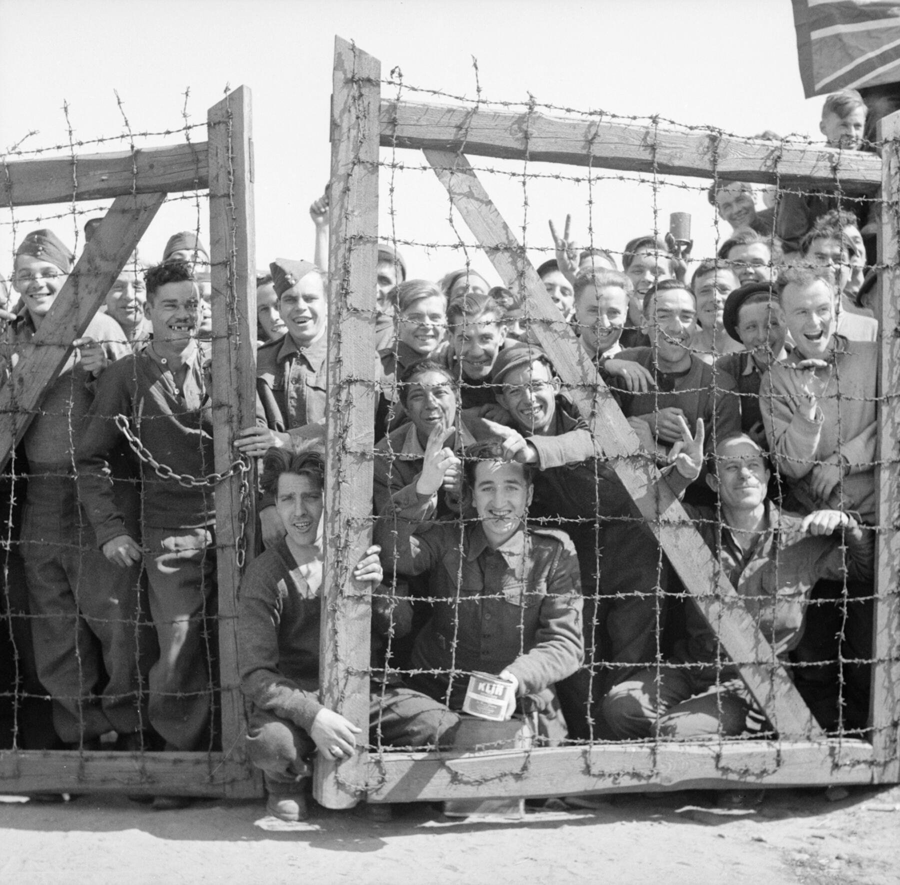

## Argyll Tour

I followed the Argylls on their attack on Veen that led to George’s
capture. On 01 March the Argylls were resting after their fighting
through the Hochwald Gap. They absorbed 54 replacements while waiting
for their next action.

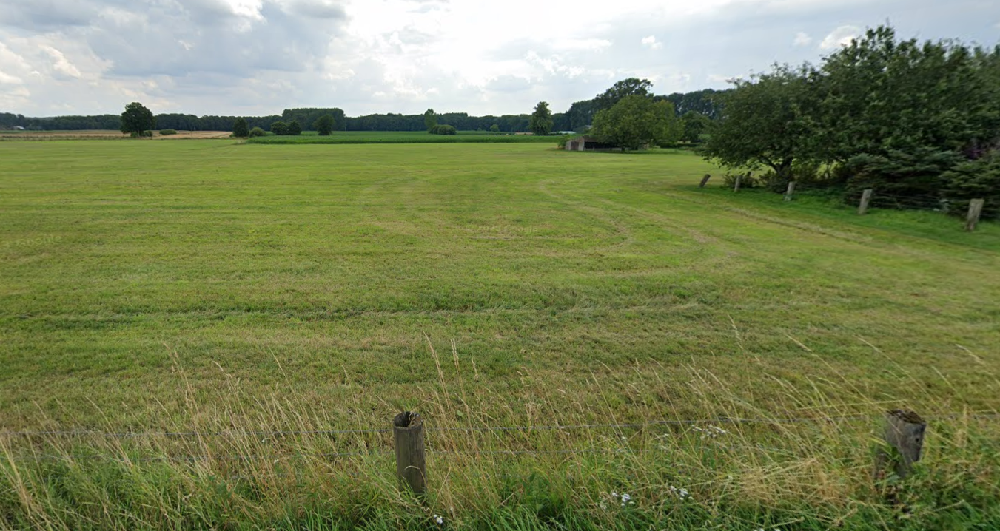

On 05 and 06 May the Argyll’s moved through Uedem in preparation for
their assault on Veen. The Argylls deployed into farmer’s fields and
forest for cover whenever possible.

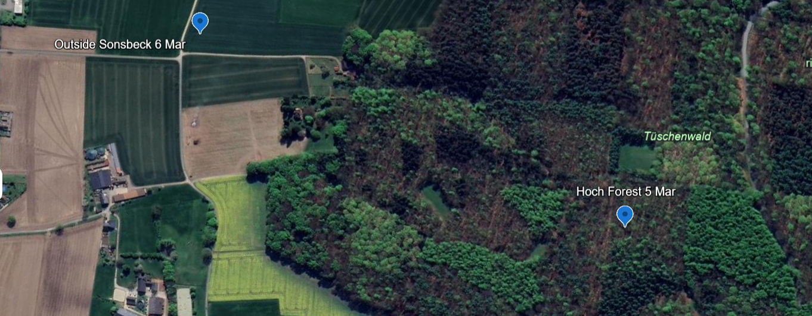

On the night of 06 May, two companies of the Argyll’s moved up to
assault Veen. They progressed well until the crossroads where they came
under heavy
fire.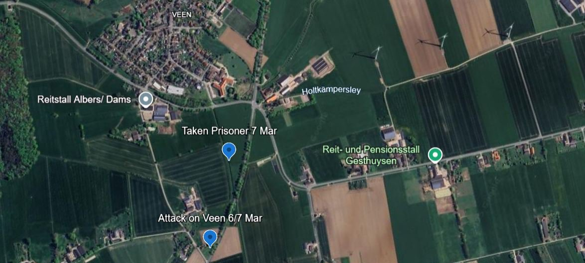

At dawn what was left of the company found itself in shallow pits and
ditches still short of the houses, although as close as 50 yards in some
places, the whole area dominated by German fire from three sides.
Movement of any kind was impossible; ammunition was almost finished. In
view of this situation, Capt. Perry surrendered his little force. With
him were taken Lieuts. Maxwell and Stewart, both badly wounded, and a
number of men, including George Johnston.

The ground is still farmland, and the ditch is still present.

The open fields provided no cover, so the ditches were the only
relatively safe areas.

Just out of sight of the previous shot, the ditch takes a 90 Degree
turn. The Google Earth image shows the camera location and the progress
of the Argylls when they were forced to surrender. The trees in the
upper left define the village of Veen.

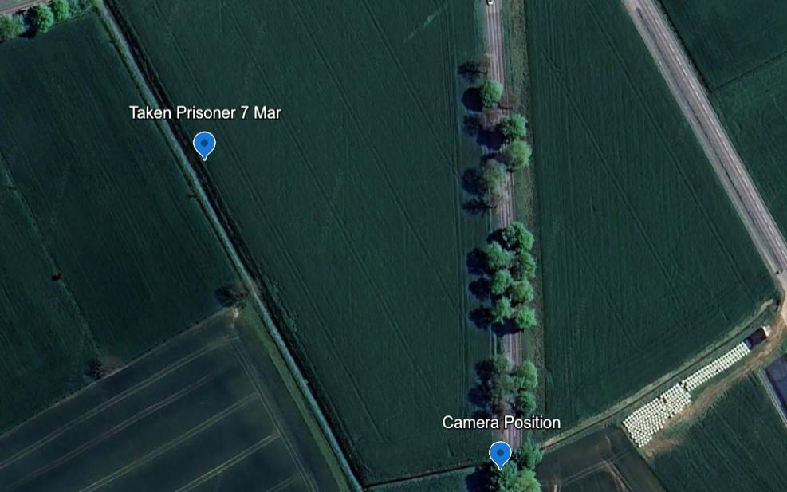

It is amazing to me how powerful it is to walk in the footsteps of a
relative. Most people see one of a million random ditches that cross the
farmland of Germany but standing on that culvert on the outskirts of a
tiny village I had no problem envisioning George in his comrades
slogging through the ditches and the fear they must have felt as they
came under withering fire. They didn’t know the rest of the battalion
had withdrawn and were likely waiting to die as they ran out of
ammunition. Surrender was their only option. Eleven Argylls were killed
as part of this assault, including Lt Stweart who was taken prisoner and
carried by his soldiers to a German Regimental Aid Post before dying a
few minutes later.

George lived just down the road from us, and I knew him as a kid. He
lived alone, never married and was very quiet so I didn’t really talk to
him very much. Like all of my other family members who were impacted by
the war, I wish I had talked to him about his experiences.

# Final Thoughts

I had mapped out the progress of Uncles Norm and George some time ago
and being able to follow their paths and walk the ground really gave me
a good idea what their struggles must have been. Throughout the
Netherlands and Germany west of the Rhine the land is very flat and low
lying. In every plowed field you can see the water levels and the
innumerable drainage ditches, canals and rivers that made great
defensive positions and a nightmare for the attacking forces.

The tanks and armoured vehicles were forced to operate on raised roads
that silhouetted the armoured regiments and made them sitting ducks. The
infantry was regularly forced to fight without armoured support and had
to slog through water-logged fields with no cover, to attack well dug in
enemy.

Given the state of suffering throughout Holland and the brutality of the
German occupation, it was easy to see why the Dutch were so grateful to
their Canadian liberators. The Dutch recognized the price Canadian
soldiers had paid. First Canadian Army in Northwest Europe had suffered
44,339 casualties since the Juno Beach landings of June 6, 1944. Of
these, 961 officers and 10,375 other ranks were killed. Virtually all of
these men were volunteers, the largest such body to fight in the war.
When the Dutch learned that these men had come to their liberation
freely and at such great cost in lives, the depth of gratitude only
deepened.
