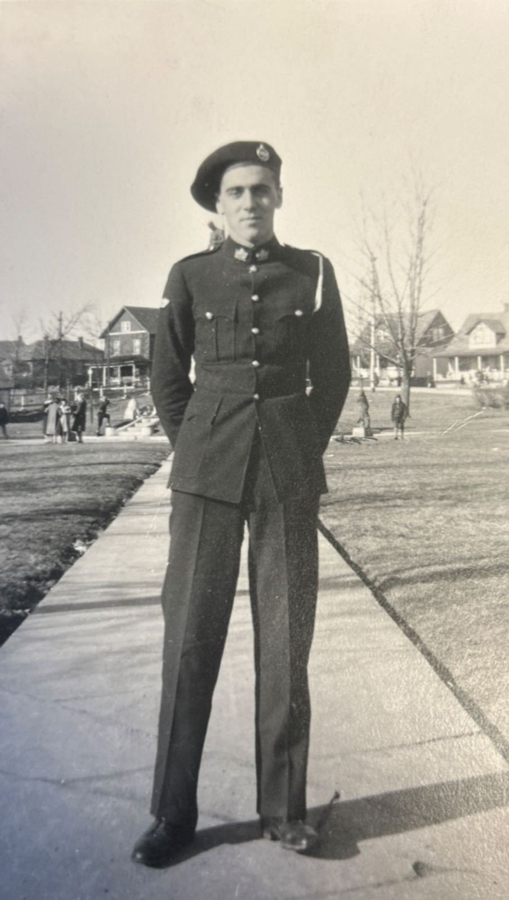

# WW2

Posts tagged with **WW2**.

## Posts

::::{grid} 1 1 2 2

:::{card} Write Journal Articles with MyST Markdown: Auto-Generate PDFs and Websites
:link: /posts/myst-article-template
:header: 
April 15, 2026 - A step-by-step tutorial on writing journal articles in MyST Markdown with automatic PDF generation and website deployment using a GitHub template.
:::

:::{card} Norm Kightley
:link: /posts/ServiceRecordNormKightley
:header: 
April 15, 2026 - The Battle experience of Uncle Norm Kightley
:::

:::{card} Battle of the Scheldt
:link: /posts/BattleoftheScheldt
:header: 
April 15, 2026 - A step-by-step tutorial on writing journal articles in MyST Markdown with automatic PDF generation and website deployment using a GitHub template.
:::

::::
